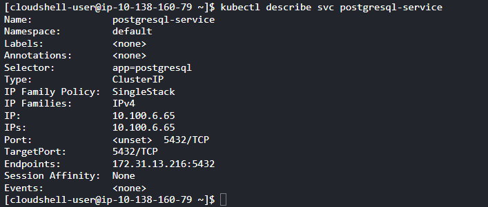
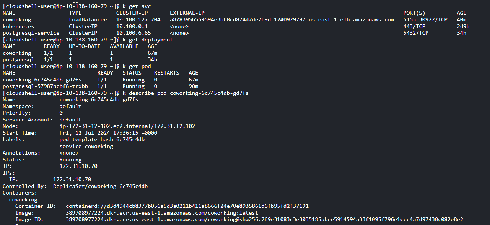
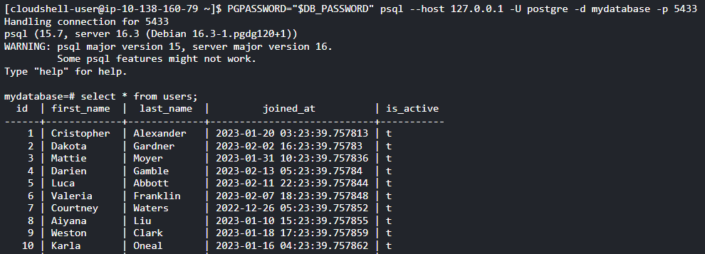
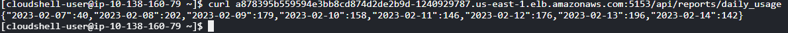
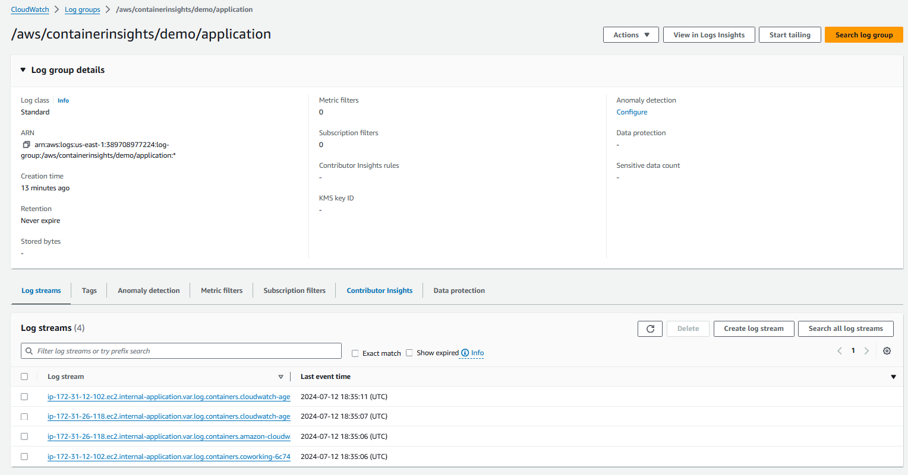
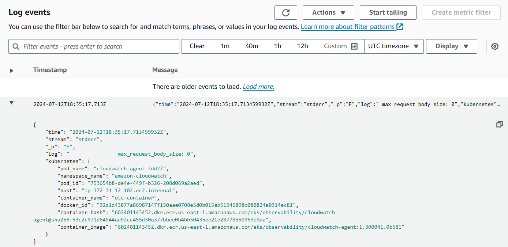

# Project: Operationalizing a Coworking Space Microservice

## Contents

+ [Overview](#Overview)
+ [Workflow](#Workflow)

## Overview

The Coworking Space Service is a set of APIs that enables users to request one-time tokens and administrators to authorize access to a coworking space.

This service follows a microservice pattern and the APIs are split into distinct services that can be deployed and managed independently of one another.

For this project, you are a DevOps engineer who will be collaborating with a team that is building an API for business analysts. The API provides business analysts with basic analytics data on user activity in the coworking space service. The application they provide you functions as expected, and you will help build a pipeline to deploy it to Kubernetes.

## Workflow

### [Build and Deploy Containers to ECR](work/ecr.md)

- Store Docker images in ECR: 

- Run CodeBuild pipeline to deploy Docker image to AWS ECR:

### [Kubernetes Configuration](work/k8s.md)

- The functional Kubernetes YAML configuration files is stored at `./deployments`.
    - `application` folder: the K8s config for the application. The application source code is at `./data/app`.
    - `database` folder: the k8s config for the Postgre database. SQL script to mock data is at `./data/db`.

- Deploy Kubernetes services:
    - Database service:
    

    - Application service:
    

- Test database connection:

- Sample request to application:

### [Logging](work/logging.md)

- CloudWatch Container Insights logs:

## Automate Deployment Process

Whenever a new change is committed to repository, it will trigger CodeBuild pipeline to run through steps defined in `buildspec.yml` file.

- Pre-build phase: sets up a connection to ECR.
- Build phase: builds and tags the Docker image that is created. `Dockerfile` is in `./data` folder.
- Post-build phase: pushes Docker image into ECR.
